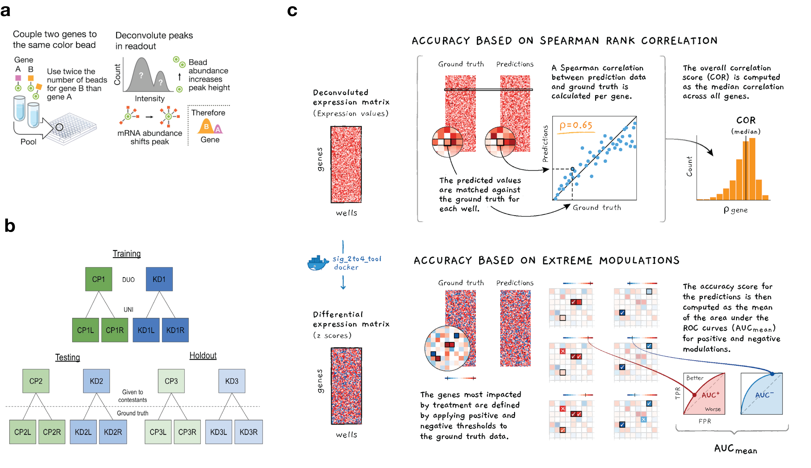
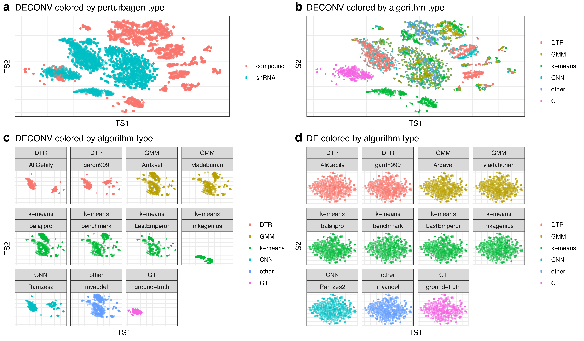
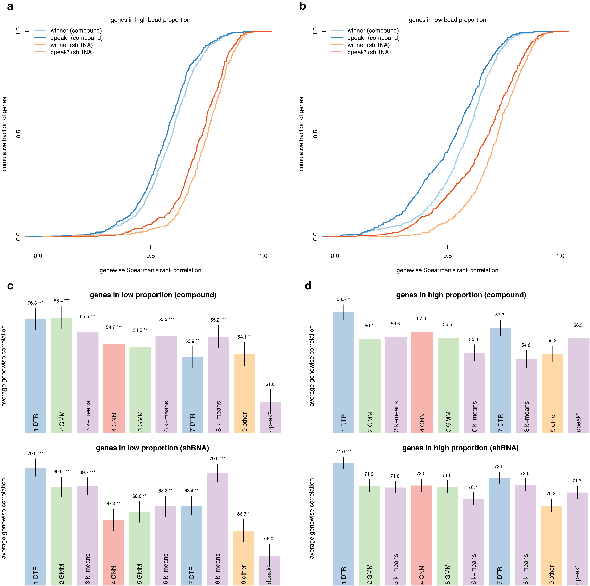
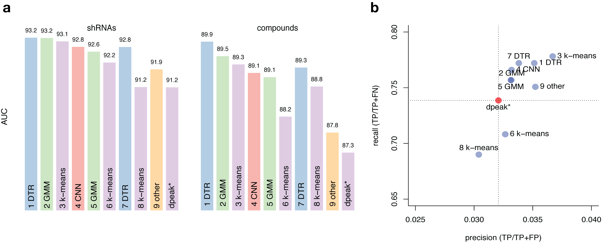
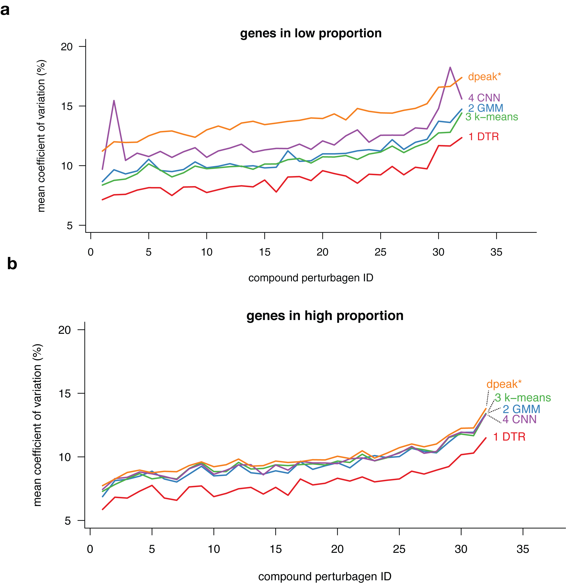

\clearpage 

# Tables and Figures

```{r setup-and-libraries, include = FALSE}
library(data.table)
library(ggplot2)
library(ggrepel)
library(cmapR)
library(pheatmap)
library(dplyr, warn=F)
```

```{r acc-vs-speed-data, include = FALSE}
speed_acc <- fread("data/holdout_score_time.txt", na.strings="n/a")
soln_desc <- fread("data/solution_descriptions.txt", na.strings="n/a")
speed_acc <- merge(speed_acc, soln_desc, by="handle")
```

\clearpage 

## Figure 1 {#figure-methods -}

**Schematic illustrating the computational problem, generated data, and scoring function**. Panel (**a**) provides a schematic description of the L1000 DUO detection mode and the associated deconvolution problem to be addressed by the contestants. Panel (**b**) shows the data generated for the contest comprising 6 different sets of perturbational experiments with 3 plates of compound (CP) and shRNA treatments (KD) each. Each plate was detected using DUO (2 genes per analyte) and UNI (one gene per analyte) with UNI serving as the ground truth. Contestants were given two plates of data for training their models offline; a second set of two plates was used during the contest for testing and to populate the live leaderboard; and the third set of two was used as holdout to determine the final contestant placements. Panel (**c**) illustrates the accuracy component of the scoring function that was used to evaluate the solutions submitted by the competitors. A solution's overall accuracy score was the product of the genewise Spearman rank correlations with ground truth (DECONV data) and the area under the curve AUC of extreme modulations (DE data).


 
\clearpage 

## Figure 2 {#figure-tsne -}

**Clustering of solutions.** Each point represents the two-dimensional projection of a sample generated by UNI ground truth (GT) or by applying a deconvolution algorithm to DUO data. t-SNE was run on the 2 plates of holdout data, one each containing compound and shRNA treatmens. t-SNE was run once on all DECONV data and once on all DE data. The resulting projections were colored and subset to generate the following panels: DECONV data colored by perturbagen type (**a**) and algorithm type (**b**). DECONV (**c**) and DE (**d**) data colored by algorithm type and stratified by each individual implementation.



\clearpage 

## Figure 3 {#figure-corr -}

**Correlation between ground-truth and deconvolution samples.** This figure shows the distribution of the genewise Spearman correlation coefficients between the ground-truth (UNI) and the deconvolution data (DUO) achieved by the winning random-forest method against the k-means benchmark (dpeak*) for the subset of genes in low bead proportion (**a**) and in high bead proportion (**b**) for the shRNA and compound perturbagen types. It also shows the average and standard error of the correlation coefficients for the top-nine performing methods and the benchmark for the genes in low bead proportion (**c**) and those in high bead proportions (**d**) for both compound and shRNAs experiments.  Asterisks indicate statistical significance at \*\*\* 0.001, \*\* 0.05, and \* 0.1 level of a Wilcoxon-rank-sum test of location difference between the competitor's distribution and the corresponding distribution of the benchmark.



\clearpage 

## Figure 4  {#figure-auc -}

**Detection of extreme modulations and targeted knockdown genes.** This figure shows the AUC for the predicted differential expressions (DE data) obtained by the top-nine performing methods and the k-means benchmark (dpeak) and the corresponding ground-truth extreme modulations (as detected in the UNI data) both for the shRNA and compound samples (**a**). It also shows the computed recall and precision of the top-nine methods and the benchmark for the detection of the targeted knockdown genes for a subset of shRNA experiments (**b**).



\clearpage 

## Figure 5  {#figure-inter -}

**Variation across replicates for the top-four performing methods and the (dpeak) benchmark.** This figure shows the mean coefficient of variation for each compound perturbagen in our sample. The mean coefficient of variation is computed as the average of the gene-wise percent ratio between the interquartile-range and the median of the deconvoluted values across 10 replicates. Results are stratified by the genes in low bead proportions (**a**) and those in high bead proportions (**b**). The perturbagens on the x-axis are ordered by increasing mean coefficient of variation of the benchmark.



\clearpage

## Figure 6 {#figure-ensembles -}

**Performance of ensembles.**  This figure shows the performance in the (**a**) correlation metric and (**b**) AUC metric of the ensemble based on the median prediction of all possible combinations of a given size of the top 9 algorithms plus the benchmark. The median performance of the ensemble tends to increase with its size. However, the maximum performance in both metrics tends to plateau (or even decrease) after the ensamble reaches a size equal to 3.


