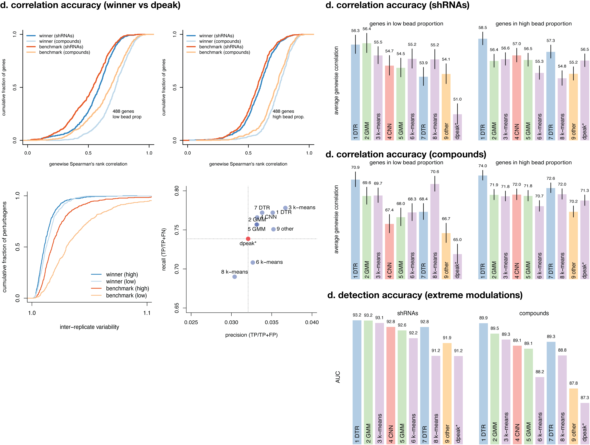

\clearpage 

# Tables and Figures

```{r setup-and-libraries, include = FALSE}
library(data.table)
library(ggplot2)
library(ggrepel)
library(cmapR)
library(pheatmap)
library(dplyr, warn=F)
```

```{r acc-vs-speed-data, include = FALSE}
speed_acc <- fread("data/holdout_score_time.txt", na.strings="n/a")
soln_desc <- fread("data/solution_descriptions.txt", na.strings="n/a")
speed_acc <- merge(speed_acc, soln_desc, by="handle")
```

## Table 1 {-}

**Top-nine performing solutions.**  This table lists the top-nine solutions and the languages and algorithms each used, as well as the average speedup per plate relative to the k-means benchmark.  

```{r top-nine, echo=F, warning=F}
setnames(soln_desc, "method_short", "category")
knitr::kable(soln_desc[1:9])
```

\clearpage 

## Figure 1 {-}

**Schematic illustrating the computational problem, generated data, and scoring function**. Panel (**a**) provides a schematic description of the L1000 DUO detection mode and the associated deconvolution problem to be addressed by the contestants. Panel (**b**) shows the data generated for the contest comprising 6 different sets of perturbational experiments. The experiments consisted of 3 plates of compound (CP) and shRNA treatments (KD) in 3 cell lines.  Each plate was detected using DUO (2 genes per analyte) and UNI (one gene per analyte) with UNI serving as the ground truth. Contestants were given two plates of data for training their models offline. The second set of two plates was used during the contest for testing and to populate the live leaderboard, and the third set of two was used as holdout to determine the final contestant placements. Panel (**c**) illustrates the accuracy component of the scoring function that was used to evaluate the solutions submitted by the competitors. A solution's overall accuracy score was the product of the genewise Spearman's rank correlations with ground truth (DECONV data) and the area under the curve AUC of extreme modulations (DE data).


 
\clearpage 

## Figure 3 {-}

**Clustering of solutions.** Each point represents the two-dimensional projection of a sample generated by UNI ground truth (GT) or by applying a deconvolution algorithm to DUO data. t-SNE was run on the 2 plates of holdout data, one each containing compound and shRNA treatmens. DECONV data colored by perturbagen type (A) and algorithm type (B). DECONV (C) and DE (D) data colored by algorithm type and stratified by each individual implementation.

```{r clus_setup, echo=FALSE}
# read tsne files and other data
tsne_de <- fread("data/holdout_tsne_DE.txt")
tsne_deconv <- fread("data/holdout_tsne_DECONV.txt")
soln_desc <- fread("data/solution_descriptions.txt", na.strings="n/a")

# add a row for ground truth
soln_desc <- rbind(soln_desc, data.table(rank="ground-truth",
                                         handle="ground-truth",
                                         method="ground-truth",
                                         method_short="GT"),
                   use.names=T, fill=T)

# extract handle and plate info
tsne_de[, handle := unlist(strsplit(rid, ":"))[1], .(rid)]
tsne_de[, plate := unlist(strsplit(unlist(strsplit(rid, ":"))[2], "_"))[1], .(rid)]
tsne_de[, pert_type := switch(plate,
                              "DPK.CP003" = "compound",
                              "LITMUS.KD019" = "shRNA"),
        .(rid)]

tsne_deconv[, handle := unlist(strsplit(rid, ":"))[1], .(rid)]
tsne_deconv[, plate := unlist(strsplit(unlist(strsplit(rid, ":"))[2], "_"))[1], .(rid)]
tsne_deconv[, pert_type := switch(plate,
                              "DPK.CP003" = "compound",
                              "LITMUS.KD019" = "shRNA"),
        .(rid)]

# merge with solution desc
tsne_de <- merge(tsne_de, soln_desc, by="handle", all.x=T)
tsne_deconv <- merge(tsne_deconv, soln_desc, by="handle", all.x=T)

# set factor levels
levs <- c("DTR", "GMM", "k-means", "CNN", "other", "GT")
tsne_de$method_short <- factor(tsne_de$method_short,
                               levels=levs)
tsne_deconv$method_short <- factor(tsne_deconv$method_short,
                               levels=levs)
```

```{r tsne_deconv-1, echo=F}
p_deconv_color_type <- ggplot(tsne_deconv, aes(x=TS1, y=TS2, color=pert_type)) +
  geom_point(alpha=0.5, size=1) +
  guides(color=guide_legend(override.aes = list(alpha=1, size=1))) +
  scale_color_discrete(name="") +
  theme_bw() +
  theme(axis.ticks.x = element_blank(),
        axis.ticks.y = element_blank(),
        axis.text.x=element_blank(),
        axis.text.y=element_blank()) +
  ggtitle("DECONV colored by perturbagen type")
```

```{r tsne_deconv-2, echo=F}
p_deconv_color_method <- ggplot(tsne_deconv, aes(x=TS1, y=TS2, color=method_short)) +
  geom_point(alpha=0.5, size=0.5) +
  guides(color=guide_legend(override.aes = list(alpha=1, size=1))) +
  scale_color_discrete(name="") +
  theme_bw() + 
  theme(axis.ticks.x = element_blank(),
        axis.ticks.y = element_blank(),
        axis.text.x=element_blank(),
        axis.text.y=element_blank()) +
  ggtitle("DECONV colored by algorithm type")
```

```{r tsne_deconv-3, echo=F}
p_deconv_facet_handle <- p_deconv_color_method + facet_wrap(~method_short+handle)
```


```{r tsne_de, echo=F}
p_de <- ggplot(tsne_de, aes(x=TS1, y=TS2, color=method_short)) +
  geom_point(alpha=0.5, size=0.5) +
  guides(color=guide_legend(override.aes = list(alpha=1, size=1))) +
  scale_color_discrete(name="") +
  theme_bw() +
  theme(axis.ticks.x = element_blank(),
        axis.ticks.y = element_blank(),
        axis.text.x=element_blank(),
        axis.text.y=element_blank()) +
  facet_wrap(~method_short+handle) +
  ggtitle("DE colored by algorithm type")
```

```{r tsne_figure, fig.height=7, fig.width=12, echo=F, warning=F, cache = TRUE, dependson = "clus_setup"}
cowplot::plot_grid(p_deconv_color_type,
                   p_deconv_color_method,
                   p_deconv_facet_handle,
                   p_de,
                   align="hv", ncol=2, nrow=2, rel_heights = c(1, 1.6),
                   labels=LETTERS[1:4])
```

\clearpage 

## Figure 4 {-}

**Improvements in accuracy**  XXX 



\clearpage 

## Figure 5 {-}

**Performance of ensembles.**  This figure shows the performance in the **A** correlation metric and **B** the AUC metric of the ensemble based on the median prediction of all possible combinations of a given size of the top 10 algorithms (including the benchmark). The median performance of the ensemble tends to increase with its size. However, the maximum performance in both metrics tends to plateau (or even decrease) after the ensamble reaches a size equal to 3.

```{r ensemble_setup, echo=F}
library(data.table)
# inputs
speed_acc <- fread("data/holdout_score_time.txt", na.strings="n/a")
ens_corr <- fread("data/DPK.CP003_PC3_24H_X1_B42_DECONV_correlation_scores.txt")
ens_auc <- fread("data/DPK.CP003_PC3_24H_X1_B42_DE_auc_scores.txt")
# merge
ens <- merge(ens_corr, ens_auc, by=c("algos", "nalgo"))
# compute total runtime for each algo combo
ens[, sec := {
  these_algos <- unlist(strsplit(algos, ":"))
  sum(speed_acc[handle %in% these_algos]$sec)
}, algos]
# stack
speed_acc$nalgo <- 1
setnames(speed_acc, "handle", "algos")
tmp <- rbind(ens[!grepl("benchmark", algos)], 
             speed_acc[plate=="DPK.CP003_PC3_24H_X1_B42", .(algos, cor, auc, sec, nalgo)],
             fill=T, use.names=T)
```


```{r ensemble_final, fig.width = 7.1, fig.height = 7, echo = FALSE}
bp.cor <- boxplot(cor ~ nalgo, data = ens, plot = FALSE)
bp.auc <- boxplot(auc ~ nalgo, data = ens, plot = FALSE)
par(mfrow = c(2, 2), mar = c(4,4,3,2) + .1)

# left panel
matplot(t(bp.cor$stats), type = "l", lty = c(3,2,1,2,3), col =1, ann = FALSE, axes = FALSE, ylim = c(0.55, 0.6))
axis(1, at = 1:9, 2:10)
axis(2, at = range(bp.cor$stats), format(range(bp.cor$stats), digits = 2))
box()
title(main = "Spearman's rank correlation", xlab = "# algorithms", ylab = expression(rho))
legend("bottomright", lty=1:3, c("50th percentile (median)", "25th/75th percentile", "max/min"), bty ="n")

# right panel 
matplot(t(bp.auc$stats), type = "l", col = 1, lty = c(3,2,1,2,3), ann = FALSE, axes = FALSE, ylim = c(0.92, 0.95))
axis(1, at = 1:9, 2:10)
axis(2, at = range(bp.auc$stats), format(range(bp.auc$stats), digits = 2))
box()
title(main = "AUC of extreme modulations", xlab = "# algorithms", ylab = "AUC")
legend("bottomright", lty=1:3, c("50th percentile (median)", "25th/75th percentile", "max/min"), bty ="n")
```


