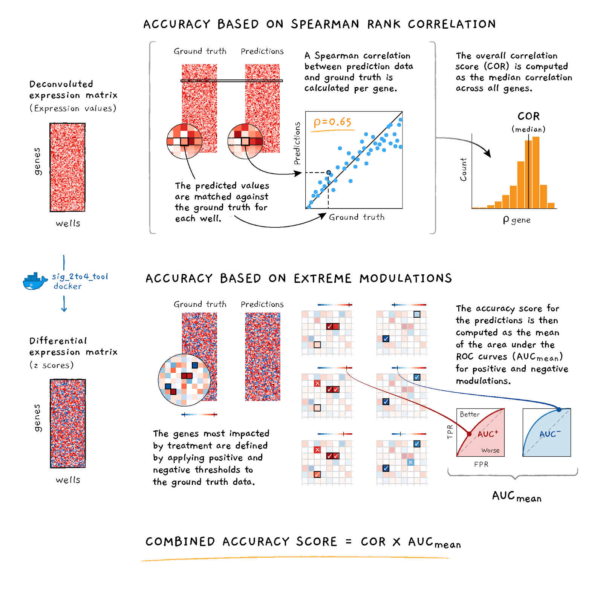

# Figures

```{r plot-setup-and-libraries, echo=FALSE, warning=FALSE}
my.pal <- palette(c("dodgerblue","brown","orange"))
library(data.table)
library(ggplot2)
library(ggrepel)
library(cmapR)
library(pheatmap)
library(dplyr, warn=F)
```

## Scoring accuracy


## Accuracy vs. Speed

```{r, echo=FALSE}
# data
speed_acc <- fread("data/holdout_score_time.txt", na.strings="n/a")
soln_desc <- fread("data/solution_descriptions.txt", na.strings="n/a")
speed_acc <- merge(speed_acc, soln_desc, by="handle")
```

```{r, echo=FALSE}
# compute composite accuracy
# in contest, aggregate score was computed as:
# SCORE = MAX_SCORE * (MAX(CORp, 0))2 * AUCp2 * exp(- Tsolution / (3 * Tbenchmark) )
# speed_acc[, acc := cor^2 * auc^2]
```


```{r speed_acc, include=FALSE}
# plot
# let's just show one plate for now
# levs <- c("DTR", "GMM", "k-means", "CNN", "other")
# speed_acc$method_short <- factor(speed_acc$method_short,
#                                  levels=levs)
# ggplot(speed_acc[grepl("^DPK", plate)],
#        aes(x=sec, y=acc, label=rank)) +
#   geom_point(aes(color=method_short), size=2) +
#   geom_text_repel() +
#   scale_color_discrete(name="Method class") +
#   xlab("Time (seconds)") +
#   ylab("Accuracy") +
#   theme_classic() +
#   ggtitle("Accuracy vs. Speed")
```

```{r setup, echo=F}
impute <- function(x, value) ifelse(is.na(x), value, x)
n <- nrow(speed_acc)
attach(speed_acc)
```

```{r acc-vs-speed, fig.width=8, fig.height=3.5, fig.cap=cap, echo=FALSE}
cap <- "\\label{fig:acc-vs-speed}**Accuracy vs speed.** This figure shows the relationship between improvements in AUC (A.), correlation (B.) and fraction of correctly predicted knocked-down genes(C.) and improvements in speed for the top-nine solutions. These measures are computed for each of the plates on the holdout dataset. Labels at the dots indicate the rank of the submission in the final leaderboard (1 = first best, 2 = second best, etc.). Dashed lines indicate levels with no improvement over the benchmark. Dotted lines indicate (ols) association between accuracy and speed improvements. The name of the most accurate and fastest approach are highlighted in each panel."

# compute measures
bench <- handle=="benchmark"
sec.bench <- sec[bench]
auc.bench <- auc[bench]
cor.bench <- cor[bench]
kd.bench <- kd_success_freq[bench]
auc.pc <- auc/auc.bench[factor(plate)]
cor.pc <- cor/cor.bench[factor(plate)]
sec.pc <- sec/sec.bench[factor(plate)]
kd.pc <- kd_success_freq/kd.bench[factor(plate)]
method2 <- method
method2[grep("Gaussian", method)] <- "gaussian mixture"
method2[grep("forest", method)] <- "rand. forest"

# Plot
panel <- function(x,y, xlim=c(0,5), ylim=c(0,0.08), xlab="speed increase (%)", legend=T, ...){
  plot(y ~ x, xlim=xlim, ylim=ylim, xlab=xlab
    , pch=c(15:16)[factor(plate)]
    , col=c(1,2)[factor(plate)]
    , subset=!bench
    ,...)
  # lable best method
  j <- which.max(y)
  y.offset <- +0.002; x.offset <- -1
  segments(y0=y[j], x0=x[j], y1=y[j] + y.offset, x1=x[j]+x.offset)
  text(y=y[j]+y.offset, x=x[j]+x.offset, labels=method2[j], pos=3)
  # label fastest method
  j <- which.max(x)
  y.offset <- -0.001; x.offset <- -0.2
  segments(y0=y[j], x0=x[j], y1=y[j] + y.offset, x1=x[j]+x.offset)
  text(y=y[j]+y.offset, x=x[j]+x.offset, labels=method2[j], pos=1)
  # legend
  if(legend)
    legend("topright", pch=15:16, col=1:2, legend=c("plate 1", "plate 2"), bty="n")
  # rank labels
  text(y=y[!bench],x=x[!bench],labels=rank[!bench],pos=3,xpd=T, col=gray(.75))
  abline(h=0,lty=2)
  abline(v=0,lty=2)
  abline(lm(y[!bench] ~ x[!bench]), lty=3)
}
par(mfrow=c(1,2), mar=c(4,4,2,1)+0.1)
panel(abs(log(sec.pc)),log(auc.pc), ylim=c(0,0.04), ylab="auc increase (%)")
mtext(at=c(0,0), "A.", adj=0, font=2)
panel(abs(log(sec.pc)),log(cor.pc), ylim=c(0,0.07), ylab="corr increase (%)")
mtext(at=c(0,0), "B.", adj=0, font=2)
#panel(abs(log(sec.pc)), log(kd.pc),ylim=c(-0.1,0.1), ylab="kd success (%)")
#mtext(at=c(0,0), "C.", adj=0, font=2)

# Ensambles 20 x 20
# auc.ens <- sapply(auc, function(x) auc + (x - auc*x)*runif(1))
# sec.ens <- sapply(sec, function(x) sec + x)
# plot(auc.ens ~ log(sec.ens), pch=16)
```

## Gene knockdowns

```{r kd_barplot, echo=F, fig.cap=cap, fig.width=6}
cap <- "\\label{kd_barplot}**KD success frequency.** Bars represent the fraction of landmark-targeting shRNAs experiments in which the DE values indicated successful knockdown (KD). Success criteria are a z-score of less than -2 and a gene-wise rank of less than 10. Results are shown for the one plate of shRNA holdout data, containing 376 landmark-targeting shRNA experiments."

# speed_acc <- fread("data/holdout_score_time.txt", na.strings = "n/a")
# soln_desc <- fread("data/solution_descriptions.txt", na.strings="n/a")
soln_desc <- rbind(soln_desc, data.table(rank="ground-truth",
                                         handle="ground-truth",
                                         method="ground-truth",
                                         method_short="GT"),
                   use.names=T, fill=T)
speed_acc <- merge(speed_acc, soln_desc, by="handle")
levs <- c("DTR", "GMM", "k-means", "CNN", "other", "GT")
speed_acc$method_short <- factor(speed_acc$method_short,
                                 levels=levs)
# make plot
par(mar=c(6, 4, 4, 2) + 0.1, cex=0.9)
with(speed_acc[!is.na(kd_success_freq)][
  order(kd_success_freq, decreasing = F)
], {
  maxval <- max(kd_success_freq)
  offset_factor <- 0.1
  offset <- offset_factor * maxval
  cols <- rep("gray", length(kd_success_freq))
  cols[handle=="benchmark"] <- "red"
  cols[handle=="ground-truth"] <- "black"
  bp <- barplot(kd_success_freq, names.arg=handle, las=3, col=cols,
           ylab="Fraction of successful KD predictions",
           main="Gene Knockdown Success Frequency",
           ylim=c(0, maxval + (2 * offset)))
  text(bp, kd_success_freq + offset, labels=round(kd_success_freq, 2), col="red")
})
```

## High / Low bead discrepancy

```{r hi_lo_bead_input, include=FALSE, echo=F}
# read the GCTX file as a GCT object
# data are stored as a matrix with genes on rows and sample/algo combos on columns
# (ds <- parse.gctx("data/DECONV_holdout_n8228x976.gctx"))
# read annotations and apply to columns
# annot <- fread("data/holdout_sample_annotations.txt")
# gene_annot <- fread("data/barcode_to_gene_map.txt", colClasses = c("gene_id"="character"))
# ds <- annotate.gct(ds, annot, dim="col", keyfield="id")
# ds <- annotate.gct(ds, gene_annot, dim="row", keyfield="gene_id")
```

```{r plot-ecdf, echo=FALSE, fig.width=9,fig.height=9, fig.cap=cap}

# datasets by handles
# handles <- unique(ds@cdesc$handle)
# all_ds <- lapply(handles, function(h) subset.gct(ds, cid=which(ds@cdesc$handle==h)))
# names(all_ds) <- handles
# 
# # benchmark vs ground truth
# gt_ds <- all_ds[["ground-truth"]]
# bench_ds <- all_ds[["benchmark"]]
# 
# # compute stats
# compute.stats <- function(mat) {
#   out <- list()
#   out$gene_level.mean <- apply(mat, 1, mean)
#   out$gene_level.sd <- apply(mat, 1, sd)
#   out$sample_level.mean <- apply(mat, 2, mean)
#   out$sample_level.sd <- apply(mat, 2, sd)
#   return(out)
# }
# all_ds.stats <- lapply(all_ds, function(x) compute.stats(x@mat))
# 
# # Compute stats for Uni and Duo benchmark
# gt_ds.stats <- all_ds.stats[["ground-truth"]] 
# bench_ds.stats <- all_ds.stats[["benchmark"]] 
# 
# # Plot differences
# cap <- paste("Differences in estimates -- ", names(gt_ds.stats))
# for (k in names(gt_ds.stats)) {
#   par(mfrow=c(3,3), mar=c(4,2,2,2)+.1)
#   for(j in setdiff(handles, c("ground-truth","benchmark"))) {
#     ecdf(gt_ds.stats[[k]] %>% log) %>% plot(main=j, xlab=k, pch=".", col=1)
#     ecdf(bench_ds.stats[[k]] %>% log) %>% lines(pch=".", col=2)
#     ecdf(all_ds.stats[[j]][[k]] %>% log) %>% lines(pch=".", col=3)
#     legend("topleft", col=1:3, lty=1, bty="n", c("Uni (no-deconv)", "Duo (k-means)", "Duo (comp.)"))
#   }
# }
```

```{r, echo=F}
# example - plot raw expression values by high vs low bead in ground truth
# row_groups <- with(gt_ds@rdesc, split(1:nrow(gt_ds), high_prop))
# boxplot(list(
#   low_prop = log(gt_ds@mat[row_groups[[1]], ]),
#   high_prop = log(gt_ds@mat[row_groups[[2]], ])
# ), ylab="raw expression")
```


## Clustering of solutions

```{r clus_setup, echo=FALSE}
# read tsne files and other data
tsne_de <- fread("data/holdout_tsne_DE.txt")
tsne_deconv <- fread("data/holdout_tsne_DECONV.txt")
soln_desc <- fread("data/solution_descriptions.txt", na.strings="n/a")

# add a row for ground truth
soln_desc <- rbind(soln_desc, data.table(rank="ground-truth",
                                         handle="ground-truth",
                                         method="ground-truth",
                                         method_short="GT"),
                   use.names=T, fill=T)

# extract handle and plate info
tsne_de[, handle := unlist(strsplit(rid, ":"))[1], .(rid)]
tsne_de[, plate := unlist(strsplit(unlist(strsplit(rid, ":"))[2], "_"))[1], .(rid)]
tsne_de[, pert_type := switch(plate,
                              "DPK.CP003" = "compound",
                              "LITMUS.KD019" = "shRNA"),
        .(rid)]

tsne_deconv[, handle := unlist(strsplit(rid, ":"))[1], .(rid)]
tsne_deconv[, plate := unlist(strsplit(unlist(strsplit(rid, ":"))[2], "_"))[1], .(rid)]
tsne_deconv[, pert_type := switch(plate,
                              "DPK.CP003" = "compound",
                              "LITMUS.KD019" = "shRNA"),
        .(rid)]

# merge with solution desc
tsne_de <- merge(tsne_de, soln_desc, by="handle", all.x=T)
tsne_deconv <- merge(tsne_deconv, soln_desc, by="handle", all.x=T)

# set factor levels
levs <- c("DTR", "GMM", "k-means", "CNN", "other", "GT")
tsne_de$method_short <- factor(tsne_de$method_short,
                               levels=levs)
tsne_deconv$method_short <- factor(tsne_deconv$method_short,
                               levels=levs)
```

```{r tsne_deconv-1, echo=F}
p_deconv_color_type <- ggplot(tsne_deconv, aes(x=TS1, y=TS2, color=pert_type)) +
  geom_point(alpha=0.5, size=1) +
  guides(color=guide_legend(override.aes = list(alpha=1, size=1))) +
  scale_color_discrete(name="") +
  theme_bw() +
  theme(axis.ticks.x = element_blank(),
        axis.ticks.y = element_blank(),
        axis.text.x=element_blank(),
        axis.text.y=element_blank()) +
  ggtitle("DECONV colored by perturbagen type")
```

```{r tsne_deconv-2, echo=F}
p_deconv_color_method <- ggplot(tsne_deconv, aes(x=TS1, y=TS2, color=method_short)) +
  geom_point(alpha=0.5, size=0.5) +
  guides(color=guide_legend(override.aes = list(alpha=1, size=1))) +
  scale_color_discrete(name="") +
  theme_bw() + 
  theme(axis.ticks.x = element_blank(),
        axis.ticks.y = element_blank(),
        axis.text.x=element_blank(),
        axis.text.y=element_blank()) +
  ggtitle("DECONV colored by algorithm type")
```

```{r tsne_deconv-3, echo=F}
p_deconv_facet_handle <- p_deconv_color_method + facet_wrap(~method_short+handle)
```


```{r tsne_de, echo=F}
p_de <- ggplot(tsne_de, aes(x=TS1, y=TS2, color=method_short)) +
  geom_point(alpha=0.5, size=0.5) +
  guides(color=guide_legend(override.aes = list(alpha=1, size=1))) +
  scale_color_discrete(name="") +
  theme_bw() +
  theme(axis.ticks.x = element_blank(),
        axis.ticks.y = element_blank(),
        axis.text.x=element_blank(),
        axis.text.y=element_blank()) +
  facet_wrap(~method_short+handle) +
  ggtitle("DE colored by algorithm type")
```

```{r tsne_figure, fig.height=7, fig.width=12, fig.cap=cap, echo=F, warning=F}
cap <- "\\label{tsne_figure}**t-SNE projection of deconvoluted data.** Each point represents the 2D projection of a sample generated by UNI ground truth (GT) or by applying a deconvolution algorithm to DUO data. t-SNE was run on the 2 plates of holdout data, one each containing compound and shRNA treatmens. DECONV data colored by perturbagen type (A) and algorithm type (B). DECONV (C) and DE (D) data colored by algorithm type and stratified by each individual implementation."
cowplot::plot_grid(p_deconv_color_type,
                   p_deconv_color_method,
                   p_deconv_facet_handle,
                   p_de,
                   align="hv", ncol=2, nrow=2, rel_heights = c(1, 1.6),
                   labels=LETTERS[1:4])
```


```{r gene_clus_setup, echo=F}
# corr_ds <- parse.gctx("data/UNI_DUO_gene_spearman_correlations_holdout_n20x976.gctx")
# soln_desc <- fread("data/solution_descriptions.txt", na.strings="n/a")
# corr_ds <- annotate.gct(corr_ds, soln_desc, dim="col", keyfield = "handle")
```

```{r gene_clus, echo=F, fig.cap=cap}
# cap <- "\\label{gene_clus}**Clustering gene-level accuracy.** A clustered matrix of the gene-level correlations between algorithm predictions and UNI ground truth using DECONV data. Columns correspond to genes and rows to algorithms."
# this_ds <- subset.gct(corr_ds, cid=grep("^DPK", corr_ds@cid))
# N <- 100
# m <- t(this_ds@mat)
# rownames(m) <- this_ds@cdesc$handle
# idx <- match(rownames(m), soln_desc$handle)
# annot_df <- data.frame(method=soln_desc$method_short[idx])
# annot_df$method <- factor(annot_df$method,
#                           levels=levs)
# rownames(annot_df) <- rownames(m)
# # rownames(m) <- paste(soln_desc$method_short, rownames(m), sep=":")
# x <- seq(min(m), max(m), length.out=N)
# mypal <- c(
#   colorRampPalette(c("blue", "white"))(sum(x < 0)),
#   colorRampPalette(c("white", "red"))(sum(x >= 0))
# )
# pheatmap(m, color=mypal, scale="none",
#          show_colnames = F,
#          annotation_row=annot_df,
#          annotation_names_row = F)
```

```{r, echo=F}
# TODO: a figure showing the performance difference for the top 2 algos per gene
# genes with a large difference are those that are correctly predicted by only one
# algo, and hence might be the best candidates for improvement by ensemble approaches
# best_cor_per_gene <- apply(m, 2, max)
# best_algo_per_gene <- rownames(m)[apply(m, 2, which.max)]
# diff_to_next_best <- apply(m, 2, function(x) max(x) - max(x[-which.max(x)]))
# diff_to_median <- apply(m, 2, function(x) max(x) - median(x[-which.max(x)]))
# par(pty="s")
# plot(best_cor_per_gene, diff_to_median, col=rgb(0, 0, 0, 0.7),
#      xlab="Max. Correlation", ylab="Delta from Median Correlation")
# text_idx <- which(best_cor_per_gene >= 0.4 & diff_to_median >= 0.15)
# text(best_cor_per_gene[text_idx],
#      diff_to_median[text_idx],
#      labels=best_algo_per_gene[text_idx],
#      adj= -0.1, col="red")
# df <- data.table(handle=best_algo_per_gene,
#                  best_cor=best_cor_per_gene,
#                  med_diff=diff_to_median)
# ggplot(df, aes(x=best_cor, y=med_diff, label=handle)) +
#   geom_point(alpha=0.5) +
#   xlab("Max. correlation") +
#   ylab("Delta from median correlation") +
#   ggtitle("Algorithm-specific gene performance") +
#   geom_text_repel(data=df[best_cor >= 0.4 & med_diff >= 0.15],
#                   color="red")
```


## Complementarity

```{r best_algo_per_gene_bar, echo=F}
corr_ds <- parse.gctx("data/UNI_DUO_gene_spearman_correlations_holdout_n20x976.gctx")
plates <- unique(corr_ds@cdesc$plate)
par(mar=c(8, 4, 4, 2)+0.1, mfrow=c(1, 2))
for (p in plates) {
  this_ds <- subset.gct(corr_ds, cid=which(corr_ds@cdesc$plate==p &
                                             corr_ds@cdesc$handle != "ground-truth"))
  best_idx <- apply(this_ds@mat, 1, which.max)
  tbl <- table(this_ds@cdesc$handle[best_idx])
  tbl <- sort(tbl, decreasing = F)
  maxval <- max(tbl)
  offset_factor <- 0.1
  offset <- offset_factor * maxval
  cols <- rep("gray", length(tbl))
  cols[names(tbl)=="benchmark"] <- "red"
  bp <- barplot(tbl, las=3, col=cols,
           ylab="Number of genes",
           main=ifelse(grepl("^DPK", p), "compounds", "shRNA"),
           ylim=c(0, maxval + (2 * offset)))
  text(bp, tbl + offset, labels=tbl, col="red")
}
```

TODO: barplot of # of genes for which each algo. gives best prediction
- possible group by plate/low vs. high

## Ensemble
```{r ensemble_setup, echo=F}
# inputs
speed_acc <- fread("data/holdout_score_time.txt", na.strings="n/a")
ens_corr <- fread("data/DPK.CP003_PC3_24H_X1_B42_DECONV_correlation_scores.txt")
ens_auc <- fread("data/DPK.CP003_PC3_24H_X1_B42_DE_auc_scores.txt")
# merge
ens <- merge(ens_corr, ens_auc, by=c("algos", "nalgo"))
# compute total runtime for each algo combo
ens[, sec := {
  these_algos <- unlist(strsplit(algos, ":"))
  sum(speed_acc[handle %in% these_algos]$sec)
}, algos]

# stack
speed_acc$nalgo <- 1
setnames(speed_acc, "handle", "algos")
tmp <- rbind(ens[!grepl("benchmark", algos)], 
             speed_acc[plate=="DPK.CP003_PC3_24H_X1_B42", .(algos, cor, auc, sec, nalgo)],
             fill=T, use.names=T)
```

```{r ensemble_plot_cor, echo=F}
ggplot(tmp, aes(x=sec, y=cor)) +
  geom_point(aes(size=nalgo), alpha=0.6) +
  geom_point(data=tmp[nalgo==1],
             aes(x=sec, y=cor, color=algos)) +
  scale_size_continuous(breaks = seq(1, 9, 2), name="num. algos") +
  scale_color_discrete(name="handle") +
  xlab("cumulative runtime (sec)") +
  ylab("correlation score")
```

```{r ensemble_plot_auc, echo=F}
ggplot(tmp, aes(x=sec, y=auc)) +
  geom_point(aes(size=nalgo), alpha=0.6) +
  geom_point(data=tmp[nalgo==1],
             aes(x=sec, y=auc, color=algos)) +
  scale_size_continuous(breaks = seq(1, 9, 2), name="num. algos") +
  scale_color_discrete(name="handle") +
  xlab("cumulative runtime (sec)") +
  ylab("AUC score")
```


```{r ensemble_plot2_cor, echo=F}
ggplot(tmp, aes(x=nalgo, y=cor, group=nalgo)) +
  geom_boxplot() +
  geom_jitter(width=0.25, alpha=0.6) +
  scale_x_continuous(breaks=1:10) +
  xlab("# of algos combined") +
  ylab("correlation score")
```

```{r ensemble_plot2_auc, echo=F}
ggplot(tmp, aes(x=nalgo, y=auc, group=nalgo)) +
  geom_boxplot() +
  geom_jitter(width=0.25, alpha=0.6) +
  scale_x_continuous(breaks=1:10) +
  xlab("# of algos combined") +
  ylab("AUC score")
```

TODO: how does this look for precision metric?


```{r, echo=F}
# ggplot(tmp, aes(x=cor, y=auc, size=nalgo)) + 
#   geom_point(alpha=0.6) +
#   scale_size_continuous(breaks = seq(1, 9, 2), name="num. algos")
```


